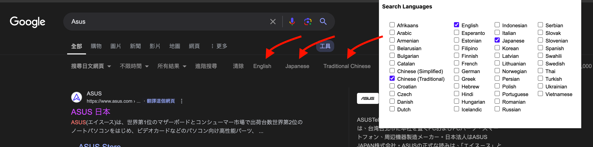

# Google search language

Add buttons to google search result page that can switch to results of certain languages.

# Install

For regular users, the extension can be installed from the [Chrome Web Store](https://chromewebstore.google.com/detail/google-search-language/imldhilgomaifdmkenenphbmhdloklmk?pli=1)

## TODO

* Launch on all google search urls (menifest.json)
* Adjust button's CSS
* Detect if current search language is set
* Better looking option
* Button on google search home page too
* Reload button when preference changed
* Grab the color of original bottoms instead of detect system setting

* Interchangable order